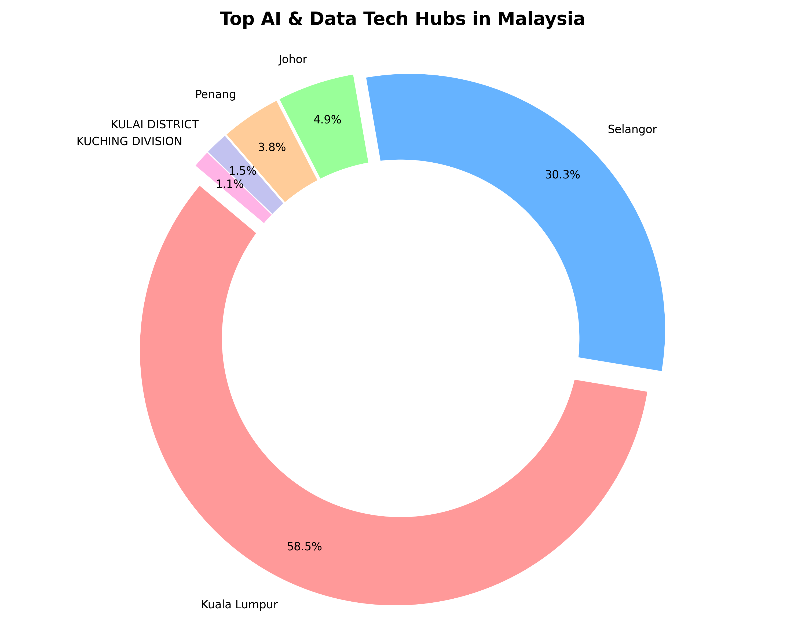
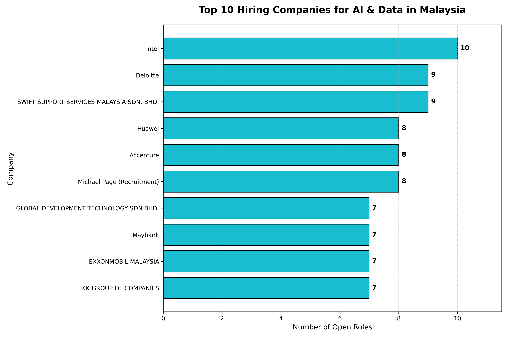
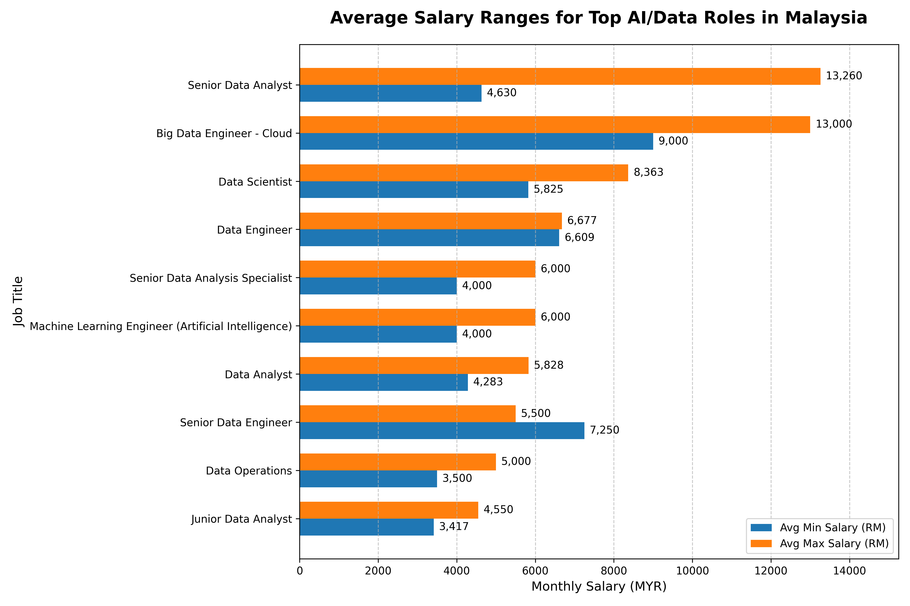

# Malaysian AI & Data Job Market Analysis

## Objective
To extract, clean, and analyze real-world job market data to uncover actionable insights regarding salary expectations, geographic tech hubs, and top employers in Malaysia's AI and Data sector. 

## Tech Stack
* **Database:** MySQL (Relational schema design, advanced queries, CASE statement data normalization)
* **Programming:** Python
* **Libraries:** * `SQLAlchemy` & `mysql-connector-python` (Database connection)
  * `Pandas` (Data manipulation)
  * `Matplotlib` (Visualization)
  * `python-dotenv` (Secure environment variable management)

## Dataset Details & ETL Process
* **Raw Data:** Over 150MB of unstructured, raw job board data (available as a compressed `.zip` in the `data/` folder).
* **Source:** *Collected from Kaggle (https://www.kaggle.com/datasets/azraimohamad/jobstreet-all-job-dataset?)*
* **The Challenge:** The raw data contained inconsistent naming conventions, unfiltered recruitment agency spam, and unnormalized salary brackets.
* **The Solution (ETL):** I built a custom MySQL schema to load the raw data, applied Entity Resolution via `CASE` statements to clean subsidiary companies, and normalized the locations into a clean, queryable format.

## Key Business Insights
1. **The Salary Benchmark:** Senior Data Analysts and Big Data Engineers command the highest market rates, peaking at ~RM 13,000+.
2. **The Geographic Hubs:** Over 88% of data roles are hyper-concentrated in Kuala Lumpur and Selangor.
3. **The Target Employers:** Global tech and consulting giants (Intel, Deloitte, Huawei) are the most aggressive recruiters in this space.

## Visualizations

### 1. Market Hubs

### 2. Top Hiring Companies

### 3. Salary Benchmarks

